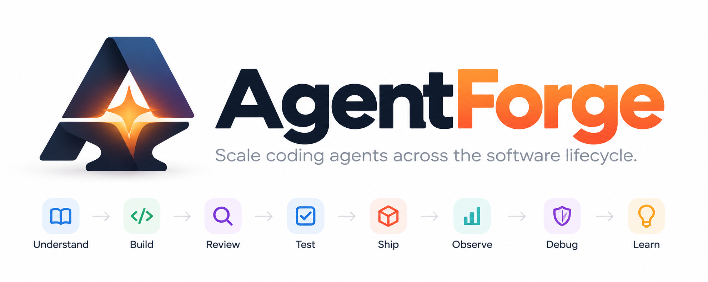

# AgentForge

<p align="center">
  
</p>

> 🚧 **Active Development**
>
> AgentForge is an experimental open-source project exploring how to make coding-agent workflows portable, governable, context-efficient, and measurable across the software lifecycle.
>
> The architecture, schemas, adapters, guardrails, evaluation framework, and repository conventions are expected to evolve as experiments produce evidence.

## Scale coding agents across the software lifecycle

AgentForge is an **open engineering control plane for coding agents**.

It explores a standardized way for repositories to expose:

- relevant context
- reusable capabilities and skills
- enterprise guardrails
- tool permissions
- evaluation requirements
- agent-runtime integration

across different coding agents and development environments.

The goal is **not** to create another coding assistant, agent runtime, prompt library, or tool protocol.

Instead, AgentForge focuses on the engineering layer that coordinates them.

```text
                    AgentForge
             Engineering Control Plane
                        │
        ┌───────────────┼───────────────┐
        ▼               ▼               ▼
     Context        Guardrails        Evals
        │               │               │
        ├───────────────┼───────────────┤
        ▼               ▼               ▼
      Skills           MCP            Agents
```

AgentForge is intentionally being developed as an experimentation and exploration project.

The project will test whether explicit agent-readable repository conventions can improve:

- task success
- context efficiency
- token consumption
- agent portability
- policy compliance
- engineering quality

rather than assuming those benefits in advance.

---

# Why AgentForge?

Coding agents are becoming increasingly capable at helping individual developers understand, write, review, and test code.

But real software engineering is a much larger system.

```text
Understand
    ↓
Design
    ↓
Build
    ↓
Review
    ↓
Test
    ↓
Ship
    ↓
Observe
    ↓
Debug
    ↓
Learn
    ────────────────┐
                    ↓
          Improve future engineering
```

As coding agents begin participating across this lifecycle, new engineering questions emerge:

- How should an agent discover the context relevant to a task?
- How can repository knowledge remain portable across different coding agents?
- How should enterprise policies constrain agent behavior?
- Which tools may an agent invoke, and under what permissions?
- How can unnecessary context and token usage be reduced?
- When should a workflow use a Skill rather than a specialized agent?
- How should agent behavior be evaluated?
- How do we distinguish plausible output from evidence-backed conclusions?
- How can lessons from production incidents improve future agent behavior?

AgentForge focuses on the **control layer around coding agents**:

> how they discover context, load skills, access tools, respect enterprise policy, and prove that their work is correct.

It is **not intended to be a collection of prompts**.

The focus is the engineering system surrounding the agents.

```text
Agents
  +
Skills
  +
Context
  +
Tools
  +
Guardrails
  +
Evaluation
  +
Organizational Knowledge
```

---

# Product philosophy

AgentForge is guided by several principles.

## 1. Agent-agnostic by default

AgentForge should not depend permanently on a single coding agent, model provider, or IDE.

The same engineering knowledge should eventually be usable from environments such as:

- GitHub Copilot
- Claude Code
- OpenAI Codex
- Google Antigravity
- other compatible coding-agent environments

Agent-specific adapters may exist where necessary, but reusable engineering knowledge should remain portable whenever possible.

---

## 2. Human-readable. Agent-explicit.

Software repositories have traditionally been optimized for humans.

Modern coding agents can already navigate conventional repositories, inspect source code, read documentation, analyze Git history, and infer architecture.

AgentForge does **not** aim to replace those conventions with a separate machine-only repository.

Instead, the principle is:

> **Human-readable by default. Agent-explicit where intent, constraints, context, or capabilities matter.**

Human-facing documentation remains the source of truth wherever possible.

Agent-facing metadata should reference existing documentation rather than duplicate it.

A repository may expose a lightweight AgentForge entry point such as:

```text
AGENTS.md

.agentforge/
├── manifest.yaml
├── capabilities/
├── context/
├── guardrails/
└── evals/
```

This can help an agent quickly discover:

- project purpose
- important architecture
- accepted architecture decisions
- available skills and capabilities
- build and test commands
- relevant repository context
- tool permissions
- enterprise constraints
- evaluation requirements

The objective is not to make repositories machine-readable **instead of** human-readable.

The objective is to make engineering intent unambiguous to both.

---

## 3. Portable repository contracts

AgentForge explores the idea that a repository can expose a predictable contract for coding agents.

Instead of requiring every coding agent to independently infer:

```text
Where is the architecture?
Which files matter?
Which rules apply?
Which tools may I use?
What environment am I operating in?
Which skills are available?
How should success be measured?
```

an AgentForge-aware repository can expose those answers explicitly.

Conceptually:

```text
                 Repository
                     │
                .agentforge/
                     │
           Canonical Repo Contract
                     │
        ┌────────────┼────────────┐
        ▼            ▼            ▼
     Copilot      Claude Code    Codex
        │            │            │
        └────────────┼────────────┘
                     ▼
              Shared Intent
```

The goal is to reduce repeated repository exploration while improving consistency across coding-agent environments.

This remains a hypothesis to be measured, not an assumed benefit.

---

## 4. Adapters instead of vendor lock-in

Coding agents currently use different repository instruction conventions.

AgentForge will explore lightweight adapters that translate or bootstrap the canonical AgentForge contract into agent-specific formats.

For example:

```text
                     .agentforge/
                  canonical contract
                         │
          ┌──────────────┼──────────────┐
          ▼              ▼              ▼
      AGENTS.md       CLAUDE.md      Copilot
                                        shim
          │              │              │
          └──────────────┼──────────────┘
                         ▼
                   Coding Agents
```

These adapter files should remain thin.

They should point agents toward the canonical repository contract rather than duplicating large amounts of policy or context.

A future AgentForge CLI may support workflows such as:

```text
agentforge init
agentforge inspect
agentforge doctor

agentforge export copilot
agentforge export claude
agentforge export codex
```

The purpose of adapters is compatibility.

AgentForge should not require vendors to natively support `.agentforge/` before the project can be useful.

---

## 5. Skills before agents

Not every engineering task requires another autonomous agent.

AgentForge prefers the simplest useful abstraction:

```text
Instruction
    ↓
Reusable Skill
    ↓
Tool-enabled Skill
    ↓
Specialized Agent
    ↓
Multi-agent Workflow
```

Additional autonomy should be introduced only when it produces measurable value.

---

## 6. Progressive context over giant prompts

Engineering agents should receive the context required for the current task rather than loading an entire repository or organization's knowledge into every request.

AgentForge will explore techniques such as:

- progressive disclosure
- skill routing
- repository-aware retrieval
- context compaction
- task-specific instructions
- just-in-time retrieval
- selective architecture loading
- dynamic tool discovery
- deterministic context routing
- structured organizational knowledge

Context is treated as a finite engineering resource.

---

## 7. Agent compute is not infinite

Tokens, latency, tool calls, model usage, and retries all have cost.

AgentForge treats agent efficiency as a first-class concern.

Capabilities should eventually measure metrics such as:

- task success
- tokens consumed
- execution time
- cost
- tool calls
- retries
- code churn
- failure modes
- context consumed

The objective is not simply to make agents do more.

It is to make them **perform useful engineering work efficiently and reliably**.

---

## 8. Enterprise guardrails are first-class

Coding agents may provide their own platform and model safety mechanisms.

Enterprise environments require another layer.

Organizations need to control not only what an agent technically *can* do, but what it is **permitted to do inside that organization, repository, application, environment, and task**.

AgentForge therefore treats enterprise guardrails as a core platform capability.

Guardrails may exist at several levels:

```text
Enterprise
    ↓
Business Unit
    ↓
Team / Platform
    ↓
Repository
    ↓
Environment
    ↓
Task
```

Lower-level policies should be able to strengthen mandatory higher-level policies, but should not silently weaken them.

### Behavioral guardrails

Examples include:

- architecture conventions
- secure coding requirements
- approved libraries
- logging standards
- data-handling requirements
- testing expectations
- dependency rules

### Tool and permission guardrails

For example:

```text
GitHub
  read repository         ALLOW
  create branch           ALLOW
  merge main              REQUIRE APPROVAL

Observability
  query production logs   ALLOW

Production database
  read                    DENY
  write                   DENY

Kubernetes production
  inspect                 ALLOW
  mutate                  DENY
```

### Artifact guardrails

Generated artifacts may also need to satisfy enterprise requirements such as:

- dependency allowlists
- license policies
- vulnerability thresholds
- secrets detection
- PII policies
- architecture rules
- infrastructure policies
- minimum test requirements

Where practical, consequential guardrails should be **enforced by the runtime or tool layer**, rather than relying only on natural-language instructions to the model.

```text
Agent
  ↓
Skill / Workflow
  ↓
Guardrail Evaluation
  ↓
ALLOW
DENY
REQUIRE APPROVAL
  ↓
Tool Execution
```

---

## 9. Evidence over plausibility

AI systems can generate explanations that sound convincing without being correct.

For tasks such as code review, incident investigation, and root-cause analysis, AgentForge distinguishes between:

```text
Observation
Hypothesis
Supporting Evidence
Contradicting Evidence
Confidence
Next Validation Step
```

A plausible explanation is not the same as a verified root cause.

AgentForge will favor evidence-driven workflows wherever possible.

---

## 10. Evaluation is part of the capability

Every significant AgentForge capability should eventually define how its performance is measured.

A capability without an evaluation strategy is considered incomplete.

Evaluation may include:

- deterministic checks
- task-success evaluation
- regression testing
- model graders
- trajectory evaluation
- human evaluation
- cost measurement
- latency measurement
- policy-compliance evaluation

---

## 11. Human control at consequential boundaries

Agents may autonomously investigate, analyze, generate, test, and recommend.

Actions such as:

- merging code
- deploying software
- modifying production infrastructure
- changing enterprise policies
- executing destructive commands

should require explicit authorization unless an organization deliberately configures otherwise.

---

## 12. Engineering organizations should learn

Software teams already generate large amounts of engineering knowledge:

- pull-request feedback
- architecture decisions
- production incidents
- postmortems
- test failures
- operational runbooks
- ownership patterns
- recurring defects

Much of this knowledge remains fragmented.

AgentForge will explore how historical engineering evidence can be transformed into reusable skills, policies, contextual guidance, and evaluation scenarios.

---

# Product model

AgentForge is currently envisioned as two complementary layers.

## Engineering capabilities

These are the workflows agents perform.

```text
Developer Onboarding
Coding Assistance
Code Review
Testing
Autonomous QA
Production Debugging
Organizational Learning
```

## Platform capabilities

These enable engineering agents to operate reliably across repositories and agent runtimes.

```text
Agent-aware Repository Contract
Adapters
Context Routing
Skills
Tool Integration
Enterprise Guardrails
Permissions
Evaluation
Observability
Token / Cost Optimization
Organizational Knowledge
```

---

# Planned engineering capabilities

## Developer onboarding

Help a new engineer or coding agent understand an unfamiliar repository.

Potential capabilities include:

- repository mapping
- architecture discovery
- code-ownership inference
- dependency analysis
- Git-history analysis
- important-file recommendations
- system walkthroughs
- architecture diagrams

The goal is to reduce the amount of manual exploration required before productive work can begin.

---

## Coding assistance

Provide repository-aware engineering guidance while software is being developed.

Possible capabilities include:

- architecture-aware coding
- repository-specific standards
- reusable Agent Skills
- dependency minimization
- secure-coding guidance
- implementation patterns
- context optimization
- token-efficient development

---

## Code review

Use agents to augment pull-request review.

Potential review capabilities may evaluate:

- architecture
- security
- maintainability
- testing
- regressions
- simplicity
- organizational standards

Rather than executing every reviewer on every pull request, AgentForge will explore risk-based routing so that only relevant capabilities are invoked.

For example:

```text
Documentation-only change
        ↓
Minimal review

Authentication change
        ↓
Architecture Review
Security Review
Test Review
```

---

## Testing and autonomous QA

AgentForge will explore agent-driven testing across multiple levels.

Potential capabilities include:

- unit-test generation
- missing-test identification
- regression testing
- risk-based test-plan generation
- browser automation
- Playwright integration
- screenshot collection
- console-error inspection
- network-error inspection
- automated QA reporting

A future QA workflow may look like:

```text
Pull Request
    ↓
Understand Change
    ↓
Generate Test Plan
    ↓
Prepare Test State
    ↓
Run Application
    ↓
Browser Automation
    ↓
Collect Evidence
    ↓
Validate Behavior
    ↓
Generate QA Report
```

---

# Production debugging

Production debugging is intended to become one of AgentForge's primary showcase capabilities.

Modern observability systems already capture enormous amounts of useful operational evidence:

- logs
- distributed traces
- metrics
- exceptions
- alerts
- deployments
- infrastructure events

The harder problem is often connecting those signals across systems and relating them back to the source code that produced them.

AgentForge will explore workflows such as:

```text
Production Alert
      ↓
Observability Evidence
      ↓
Service Correlation
      ↓
Distributed Trace
      ↓
Source Repository
      ↓
Git / Deployment History
      ↓
Candidate Hypotheses
      ↓
Evidence Validation
      ↓
Reproduction
      ↓
Proposed Fix
      ↓
Regression Test
```

Potential observability integrations include:

- Datadog
- Splunk
- Dynatrace
- Elastic
- Prometheus
- OpenTelemetry-compatible platforms

The core debugging workflow should remain vendor-neutral.

---

# Incident Evidence Graph

Production incidents often require engineers to manually connect information spread across many systems.

AgentForge will explore representing this operational evidence as an **Incident Evidence Graph**.

For example:

```text
Pull Request
     │
   Commit
     │
 Deployment
     │
  Service
     │
 Kubernetes Pod
     │
    Span
     │
   Trace
     │
 Exception
```

Additional relationships may include:

```text
Configuration
Feature Flag
Dependency
Database Query
User Request
Release
Metric
Log Event
```

Instead of repeatedly searching disconnected systems, an agent could traverse relationships between pieces of evidence.

This graph can support evidence-based hypothesis generation and validation.

---

# Organizational learning

AgentForge will eventually explore how engineering history can improve future agent behavior.

For example:

```text
Historical PR Reviews
        ↓
Repeated Review Pattern
        ↓
Candidate Engineering Rule
        ↓
Human Review
        ↓
Approved Rule
        ↓
Reusable Agent Skill
```

The same approach could potentially learn from:

- production incidents
- architecture decisions
- security findings
- recurring bugs
- test failures
- operational postmortems

The goal is not autonomous policy creation.

The goal is to help organizations convert **implicit engineering knowledge into explicit, reusable guidance**.

---

# Capability Contract

AgentForge capabilities should eventually follow a common contract.

```text
Capability
│
├── Purpose
├── Inputs
├── Required Context
├── Required Skills
├── Tools
├── Permissions
├── Guardrails
├── Workflow
├── Expected Output
├── Failure Modes
├── Safety Boundaries
└── Evaluations
```

This makes capabilities easier to understand, compare, evaluate, and port across coding-agent environments.

---

# Architecture direction

The implementation architecture is still being explored.

The current conceptual model is:

```text
                      Engineering Task
                             │
                             ▼
                     Agent / Runtime
                             │
              ┌──────────────┼──────────────┐
              │              │              │
              ▼              ▼              ▼
            Skills        Context         Tools
              │              │              │
              └──────────────┼──────────────┘
                             │
                             ▼
                    Guardrail Engine
                             │
               ┌─────────────┼─────────────┐
               │             │             │
               ▼             ▼             ▼
             GitHub         MCP        Runtime APIs
                               │
                    ┌──────────┼──────────┐
                    ▼          ▼          ▼
              Observability  Browser   Enterprise
                                         Systems
                    │
                    ▼
                 Evidence
                    │
                    ▼
                Evaluation
```

Cross-cutting concerns include:

- context management
- token efficiency
- security
- permissions
- observability
- evaluation
- governance
- portability
- enterprise policy enforcement

---

# Agent-aware repository design

AgentForge itself will be developed using the same principles it promotes.

The repository is expected to expose both conventional human documentation and explicit agent-facing configuration.

A possible structure is:

```text
agentforge/
│
├── README.md
├── AGENTS.md
├── ROADMAP.md
├── CONTRIBUTING.md
│
├── .agentforge/
│   ├── manifest.yaml
│   ├── capabilities/
│   ├── context/
│   ├── guardrails/
│   └── evals/
│
├── docs/
│   ├── architecture/
│   ├── decisions/
│   ├── research/
│   └── evals/
│
├── skills/
├── evals/
├── benchmarks/
├── examples/
└── src/
```

The intention is to preserve **one source of truth** while exposing deterministic entry points that help coding agents discover the information relevant to their task.

---

# The `.agentforge/` convention

The `.agentforge/` directory is intended to become the repository-specific control surface for AgentForge.

It should contain only information that AgentForge tooling or compatible adapters may need to discover, interpret, validate, or enforce programmatically.

It should **not** become a duplicate documentation tree.

For example:

```text
docs/architecture/context-routing.md
```

may explain context routing to humans, while:

```text
.agentforge/context/routes.yaml
```

may define executable routing behavior.

Similarly:

```text
docs/security/enterprise-guardrails.md
```

may explain the policy model, while:

```text
.agentforge/guardrails/enterprise.yaml
```

may contain machine-readable policy.

The initial `.agentforge/` specification is expected to remain deliberately small and evolve based on experimentation.

---

# Adapter model

AgentForge should not assume coding agents will natively understand `.agentforge/`.

Instead, compatibility can be introduced through lightweight adapters.

```text
                     .agentforge/
                  canonical contract
                         │
         ┌───────────────┼────────────────┐
         ▼               ▼                ▼
      AGENTS.md       CLAUDE.md        Copilot
                                         shim
         │               │                │
         └───────────────┼────────────────┘
                         ▼
                    Agent Runtime
```

Adapters may:

- bootstrap the coding agent into the AgentForge contract
- expose relevant instructions in the agent's preferred format
- translate repository metadata where required
- avoid duplicating the canonical configuration
- validate compatibility between AgentForge and the target runtime

A future CLI may automate generation and validation of these adapters.

---

# Evaluation

AgentForge is intended to be developed experimentally.

Instead of asking only:

> Does this agent work?

the project should ask:

> Under what conditions does it work, how reliably does it work, what does that reliability cost, and did the agent remain within applicable policies?

Example measurements may include:

```text
Task Success Rate
First-pass Success
Tokens per Task
Cost per Successful Task
Execution Latency
Tool Calls
Retries
Code Churn
Test Pass Rate
Review Precision
False-positive Findings
Root-cause Accuracy
False RCA Rate
Time to Root Cause
Guardrail Violations
Approval Requests
Context Consumed
```

Where practical, changes to agent behavior should be supported by reproducible experiments.

---

# Agent-aware repository experiments

One of AgentForge's foundational research questions is whether explicit repository contracts provide measurable value.

For example:

```text
Experiment A
Ordinary repository
        vs
Same repository + AgentForge contract
```

Potential measurements:

```text
Task success
Files inspected
Tokens consumed
Tool calls
Time to first useful action
Architecture-rule violations
Policy violations
Incorrect assumptions
```

If explicit AgentForge metadata does not produce meaningful improvements, the convention should be simplified or reconsidered.

The project favors evidence over architectural enthusiasm.

---

# Reference environment

A future AgentForge reference application may provide a controlled environment for evaluating engineering agents.

For example:

```text
demo-shop/
├── web/
├── checkout-service/
├── pricing-service/
├── inventory-service/
└── telemetry/
```

Known defects could intentionally be introduced, such as:

- null-handling failures
- dependency timeouts
- inefficient database queries
- missing unit tests
- UI regressions
- configuration problems
- security issues
- telemetry gaps

The same scenarios could then be reused to compare:

- coding agents
- models
- skills
- prompts
- context strategies
- tool configurations
- guardrail policies
- AgentForge versus non-AgentForge repository structures

---

# Roadmap

The roadmap is intentionally expected to evolve as experiments generate evidence.

## V0 — Foundation

- project vision
- architecture principles
- agent-aware repository model
- initial `.agentforge/` convention
- `AGENTS.md`
- adapter strategy
- Architecture Decision Records
- Capability Contract
- evaluation methodology
- initial enterprise guardrail model

## V1 — Repository contract and portability

- initial `manifest.yaml`
- AgentForge schema validation
- context-routing experiments
- lightweight coding-agent adapters
- agent-ready repository benchmarks
- initial CLI exploration
- token/context baseline measurement

## V2 — Core engineering workflows

- onboarding skill
- code-review skill
- unit-testing skill
- reusable skill structure
- coding-agent portability experiments
- risk-based capability routing

## V3 — Autonomous QA

- Playwright integration
- risk-based test-plan generation
- browser-based execution
- screenshot and evidence collection
- console/network inspection
- QA reporting

## V4 — Production debugging

- vendor-neutral observability abstraction
- logs, traces, and metrics
- Git and deployment correlation
- Incident Evidence Graph
- evidence-based root-cause analysis
- production-debugging evaluations
- permission and guardrail enforcement

## V5 — Organizational learning

- analyze historical engineering feedback
- identify recurring patterns
- propose reusable engineering guidance
- human approval workflow
- skill evolution
- incident-to-policy feedback loops

---

# Current research areas

AgentForge will initially explore questions such as:

- Does explicit agent-facing repository metadata reduce exploration time?
- Does an AgentForge repository contract reduce token consumption?
- How much context should be explicit versus dynamically discovered?
- Can one canonical repository contract work across multiple coding agents?
- How thin can vendor-specific adapters remain?
- Does progressive context loading reduce token usage without lowering task success?
- When should a workflow be implemented as a Skill versus an Agent?
- When does multi-agent execution outperform a single agent?
- Can enterprise guardrails be enforced independently of the underlying coding agent?
- Can production incidents be reliably correlated with source-code changes?
- Can historical PR feedback be converted into useful engineering guidance?
- How should agent success be evaluated beyond code compilation and test completion?
- What is the cost/quality trade-off between different agent and model configurations?

---

# What AgentForge is not

AgentForge is currently **not** intended to be:

- another general-purpose coding assistant
- a new foundation model
- a replacement for IDEs
- a replacement for MCP
- a competing Agent Skills format
- a replacement for observability platforms
- a fully autonomous software-development organization
- a collection of unmeasured prompts
- permanently tied to one AI vendor

Instead, AgentForge focuses on the **engineering control plane that allows coding agents, tools, organizational knowledge, enterprise policies, and evaluations to work together effectively**.

---

# Project status

🚧 **Early-stage / Active Development**

AgentForge is currently in the architecture and experimentation phase.

Expect:

- incomplete capabilities
- evolving terminology
- breaking changes
- experimental schemas
- changing adapter formats
- architectural revisions
- rapidly changing implementations

Feedback, experiments, ideas, and contributions are welcome as the project develops.

---

# Contributing

Contribution guidelines will evolve as the project matures.

For now, the project strongly favors contributions that:

- address a clear engineering problem
- remain agent/provider agnostic where practical
- preserve one source of truth
- include an evaluation strategy
- preserve human-readable documentation
- avoid unnecessary complexity
- consider token and runtime efficiency
- respect enterprise security and permission boundaries
- distinguish measured improvements from assumptions

See [CONTRIBUTING.md](CONTRIBUTING.md) once available.

---

# License

AgentForge is licensed under the **Apache License 2.0**.

See [LICENSE](LICENSE) for details.