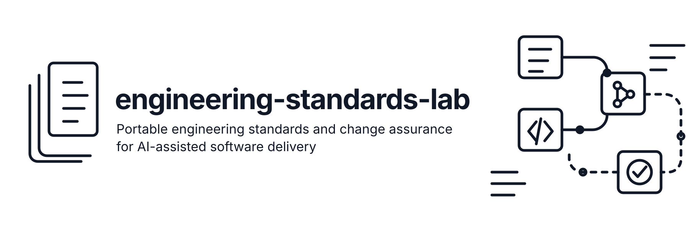

# engineering-standards-lab

<p align="center">
  
</p>

> 🚧 **Research-stage project**
>
> This repository is an experimental open-source lab for testing a focused product hypothesis:
>
> **Can approved engineering standards be made portable across coding agents, applied before implementation, independently checked after implementation, and shown to reduce repeated senior-review effort?**
>
> The name `engineering-standards-lab` is intentionally temporary while the product direction and final name are being validated.

## Product thesis

AI coding tools can accelerate implementation, but organizations still need to decide whether a proposed change is appropriate for their architecture, secure, supportable, maintainable, and aligned with established engineering practice.

This project explores a narrow layer around that problem:

> **Portable engineering standards and change assurance for AI-assisted software delivery.**

The intended loop is:

```text
Engineering evidence
        ↓
Candidate engineering practices
        ↓
Human approval
        ↓
Versioned engineering requirements
        ↓
Task-specific context
        ↓
Coding agent
        ↓
Proposed change
        ↓
Independent assurance
        ↓
Human review
        ↓
Measured outcomes and feedback
```

The goal is not to replace coding agents, IDEs, scanners, CI systems, or AI code-review products.

The goal is to test whether organizations can express engineering intent once, preserve its authority and evidence, deliver the relevant subset to different coding-agent environments, and independently assess the resulting change.

---

## Why this project exists

Engineering organizations already encode important decisions across many places:

- architecture decision records
- coding and platform standards
- repository structure
- pull-request discussions
- recurring review feedback
- Git history
- tests and CI configuration
- approved exceptions
- operational requirements

Coding agents can inspect many of these sources, but inspection alone does not establish which guidance is authoritative, current, applicable, or mandatory.

This project explores whether that knowledge can be converted into **approved, versioned engineering requirements** with explicit scope, evidence, ownership, exceptions, and evaluation boundaries.

Historical evidence may be used to propose candidate practices.

It must **not** automatically become policy.

---

## Core principles

### 1. Human approval defines organizational intent

Models may discover patterns and propose candidate requirements.

Owners approve, reject, scope, amend, expire, or supersede them.

### 2. Evidence over inference

Requirements should be explainable.

Where practical, they should retain provenance such as ADRs, review comments, standards, tests, or explicit owner-authored rationale.

### 3. Deterministic where possible. Semantic where useful. Generative where necessary.

Use deterministic mechanisms for:

- identity
- scope
- versions
- structured conflict resolution
- schema validation
- executable checks

Use semantic or generative methods for tasks such as:

- candidate discovery
- summarization
- relevance interpretation
- advisory review

### 4. Guidance is not enforcement

Telling an agent about a requirement does not prove that the resulting change satisfies it.

The project therefore separates:

```text
Upstream guidance
        ↓
Coding agent
        ↓
Proposed change
        ↓
Independent checks and assessment
```

### 5. Vendor-neutral by design

The same approved engineering requirement should be usable across multiple coding-agent surfaces where practical.

Potential integration targets include environments such as:

- GitHub Copilot
- OpenAI Codex
- Claude Code
- Cursor
- Gemini CLI
- OpenHands

The project should integrate with existing conventions rather than invent another coding-agent runtime.

### 6. Context is a finite engineering resource

More context is not automatically better.

Relevant mandatory requirements should be selected first, supporting evidence second, and optional examples last.

Context selection should be evaluated against outcomes, cost, latency, and review effort.

### 7. Measure engineering outcomes

Success should not be defined by generated-code volume.

The experiments should measure things such as:

- active senior-review time
- repeated organization-specific corrections
- task acceptance
- rule-finding precision
- false positives
- deterministic check coverage
- rework
- context cost
- cross-agent portability

---

## What this project is not

This repository is not intended to become:

- another general coding agent
- another IDE
- a generic multi-agent framework
- a generic RAG platform
- a replacement SAST/SCA/secrets scanner
- a generic PR-review product
- a new MCP implementation
- a universal agent orchestration layer
- an autonomous production operator

Where mature infrastructure already exists, this project should integrate with it.

---

## Initial product boundary

The first useful implementation should stay deliberately small.

The working V0 direction is:

```text
Selected engineering evidence
        ↓
Candidate requirement discovery
        ↓
Human approval
        ↓
Git-backed requirement registry
        ↓
Task-specific context compiler
        ↓
Two coding-agent outputs
        ↓
Proposed change
        ↓
Existing tests / scanners / checks
        ↓
Change-assessment record
        ↓
Review-effort measurement
```

Likely V0 components:

- evidence ingestion from selected repository history
- candidate requirement discovery
- human approval and exception lifecycle
- versioned requirement/evidence records
- deterministic scope resolution
- sparse context compilation
- adapters to existing agent instruction surfaces
- integration with trusted CI/scanner results
- change-assessment records
- an evaluation harness comparing against strong native baselines

A central enterprise control plane is intentionally **not** a V0 requirement.

---

## Candidate open representation

A useful core artifact may be a versioned engineering requirement/evidence record.

Illustrative example:

```yaml
schema_version: "0.1"

id: api.service-boundary
owner: platform-architecture
status: approved
version: 3

scope:
  repository: orders-api
  paths:
    - src/controllers/**

kind: code_requirement

statement: >
  Controllers must call the approved service layer for persistence.

rationale: >
  Preserve transaction and authorization boundaries.

evidence:
  - ref: pr:42#review-comment-7
  - ref: adr:12

counterevidence:
  - ref: pr:51#approved-exception

evaluation:
  deterministic_check: controller-import-boundary
  advisory_review: indirect-persistence-path

exceptions: []
```

This is an experimental data model, not a published standard.

---

## Experiment before platform

The project should earn the right to become a platform.

A credible experiment compares:

```text
A. Coding agent with no new instruction bundle

B. Coding agent with competent owner-curated native instructions

C. Agent with approved task-specific compiled context

D. C plus owner-approved requirements derived from historical evidence
```

The key question is whether the additional machinery produces measurable value over a strong manually curated baseline.

If it does not, the product should narrow, integrate, pivot toward services, or stop.

---

## Open-source direction

If the hypothesis proves useful, the intended open surface may include:

- requirement/evidence schemas
- local validation
- local context compilation
- reference adapters
- conformance fixtures
- an evaluation harness

Possible enterprise value may later sit around managed approval workflows, organization-wide distribution, audit, policy health, private deployment, and support.

Those decisions are intentionally deferred until repeated product value is demonstrated.

---

## Repository status

This repository is currently an **engineering research lab**.

Expect the architecture, schemas, terminology, and directory structure to change as the original broader control-plane concept is reduced to a smaller, testable product hypothesis.

The immediate priorities are:

1. define the portable requirement/evidence model;
2. design the smallest measurable V0;
3. validate candidate discovery with human approval;
4. compile requirements into existing coding-agent surfaces;
5. connect requirements to independent change checks;
6. measure whether senior-review effort actually improves.

---

## License

Licensed under the Apache License 2.0. See [LICENSE](LICENSE).
